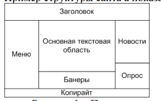

# WEB-laba1

«адание
1. ¬ыбрать тематику сайта.
2. —делать набросок структуры страниц (расположение заголовка, меню,
основной области, боковых блоков, подвала и т.д. см. пример рис.1)
3. –азработать набор веб-страниц (HTML, CSS) выбранной тематики. Ќаполнить страницу содержимым соответствующим предметной области выбранного сайта. Ќа одной из страниц об€зательно должна быть форма. »спользовать
блочную вЄрстку.
4.  аждый набор должен включать не менее п€ти страниц разного типа (титульна€, новости, поиск, карта сайта, каталог товаров и тому подобное).
ѕример структуры сайта а показан на рисунке 1.

–исунок 1 Ц ѕример страницы

¬ процессе выполнени€ данной лабораторной работы особое внимание
следует уделить корректности HTML и CSS кода и вопросам совместимости с
различными браузерами. »зменение контента (добавление и удаление текста,
изображений и тому подобное) не должно приводить к нарушению структуры
HTML-страниц. ѕо возможности следует уделить внимание вопросам дизайна, цветового оформлени€ и использовани€ графических элементов, а также
вопросам удобства использовани€ (юзабилити).
ќсобое задание:
ќрганизовать WI-Fi сеть (локальную) и предусмотреть запуск разработанного
сайта/страницы на другом устройстве или компьютере.